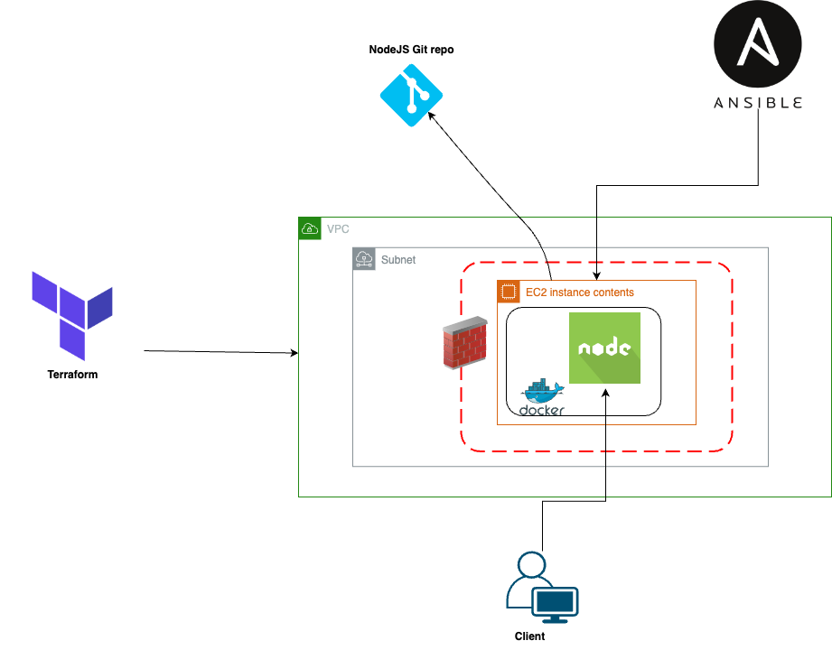

### Lifebit Technical Assignment

This repository is meant to host all the code related to Lifebit Technical Assignment

## Stack

1. **Terraform** as our Infrastructure as Code tool.
2. **AWS** as our Cloud Vendor.
3. **EC2** as our core service to get provisioned and the NodeJS app right after.
4. **Docker** as our container tool to get the NodeJS running onto the server.
5. **Ansible** as our Configuration Management tool to deploy the NodeJS app into the server.

*Explanation*:

- The EC2 instance is the main server where the application will be deployed. It hosts the Docker container.
- Docker container is used to run the Node.js application. The Docker image is built from the [GitHub repository](https://github.com/Roleyner/api-with-express-and-handlebars) containing the Node.js app.
- The AWS Security Group (sg_ec2) controls incoming and outgoing traffic to the EC2 instance. SSH access is allowed only from the home's public IP address, ensuring secure access. Port 3000 is widely open to allow access to the Node.js application.
- The SSH key pair is used for secure SSH access to the EC2 instance during the deployment process.
- Ansible connects to the EC2 instance using SSH (also with the SSH key generated) and executes the tasks defined in the playbook to deploy the application.

## Prerequisites to provision the solution

1. Terraform
2. Ansible
3. AWS account with IAM user with enough permissions

## Deployment procedure

- Clone the repository with `git clone https://github.com/Roleyner/lifebit-assignment.git`
- In the `terraform.tfvars` file, change `region` and `ami` values according to the AWS region and AMI Ubuntu free tier you want to use
- Initialize terraform with `terraform init`
- Do the plan for the provisioning: `terraform plan`
- Do the apply to make the provisioning happen: `terraform apply`

Once the steps mentioned above have been performed, the whole stack will be provisioned and automatically, through terraform, an `ansible-playbook` command will run to install our NodeJS app and its dependencies.

## Access to the NodeJS app

Either *ansible-playbook* output or terraform output will provide us with the instance public IP to be able to use it along with the port **3000**

## Access to the VM via SSH

As a private key named *nodejs-key* gets created through terraform into the same repo root directory, we can also leverage it for sshing to the EC2 instance as follows:

`ssh -i nodejs-key vm_user@vm_ipv4_dns`

Both *vm_user* and *vm_ipv4_dns* get outputted by terraform after applying changes to the infrastructure.

### Caveat

It's importante to tear down all the AWS resources used for this implementation, hence `terraform destroy` needs to be performed :)